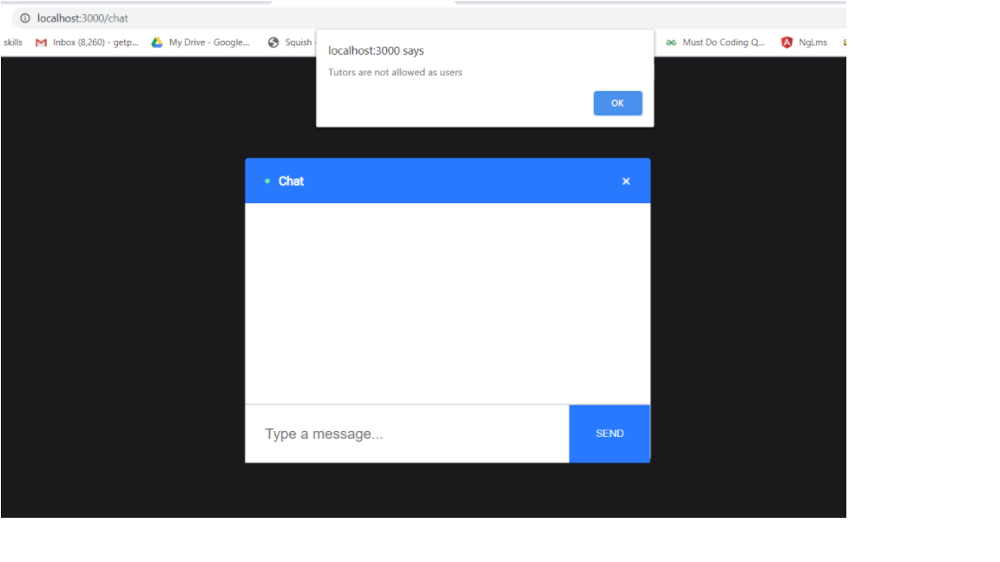
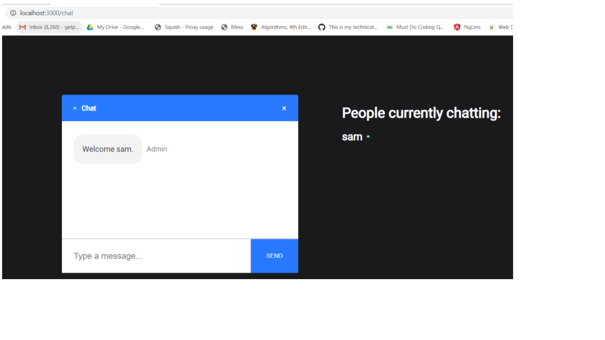
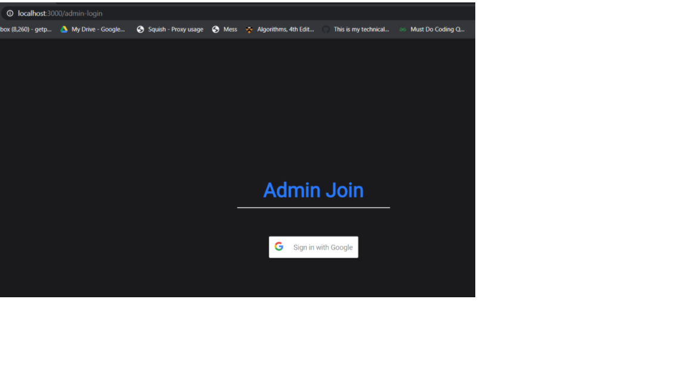
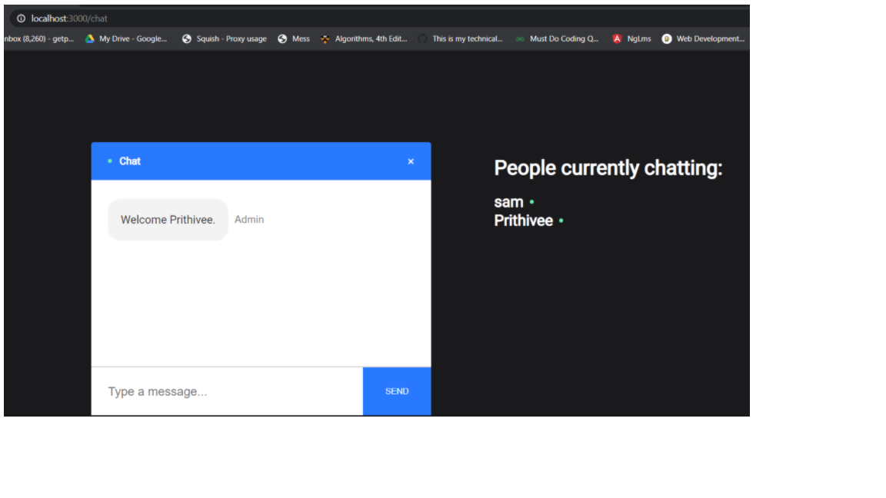
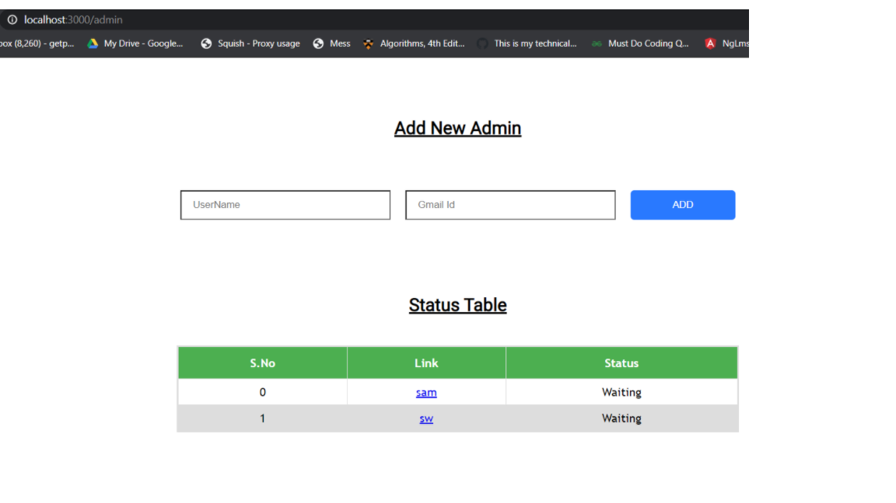
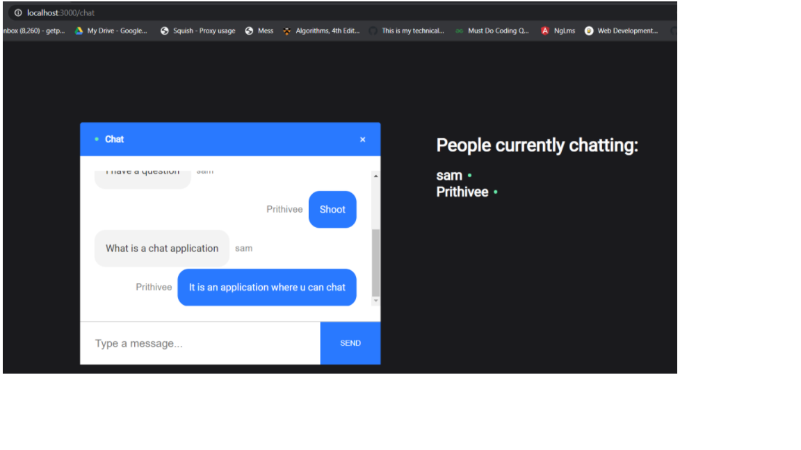

## Introduction
  This is a code repository of a real time chat application between a student and a tutor, where the student can get his/her queries answered from tutors who are experts. The chat application focuses on privacy and user friendliness.

The frontend is built with React and the backend is handled by Node.js and socket.io.
For realtime bidirectional communication web socket library socket.io is used.

## Salient Features:
* A room will contain only a single student so the student can clear all his queries without any interference.
* Since there are multiple tutors the student doesnt have to wait.
* This application is not confined only to teacher and student .It is a generic application. It is also applicable for private chat between any individuals in an organisation.

The student logins with his name and his mail. Authentication is done by google login.

After the student successfully logs in he is taken to the private room

Login page for admin.

Tutor's chat window - After the tutor had joined. 

When multiple users are waiting in the waiting room

